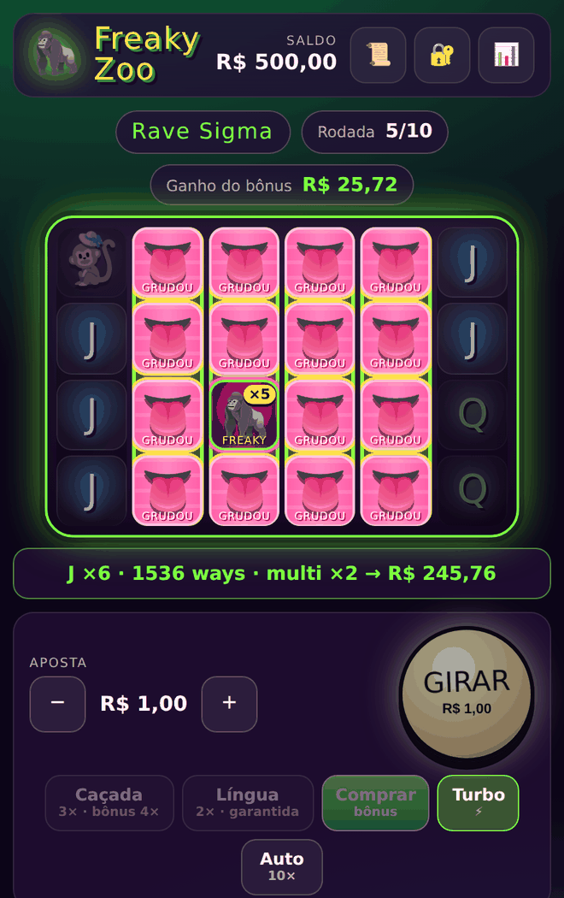
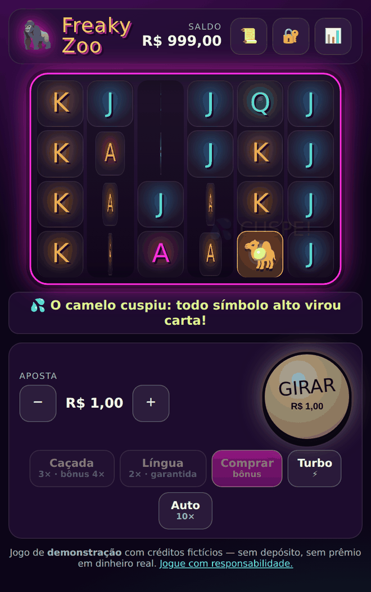
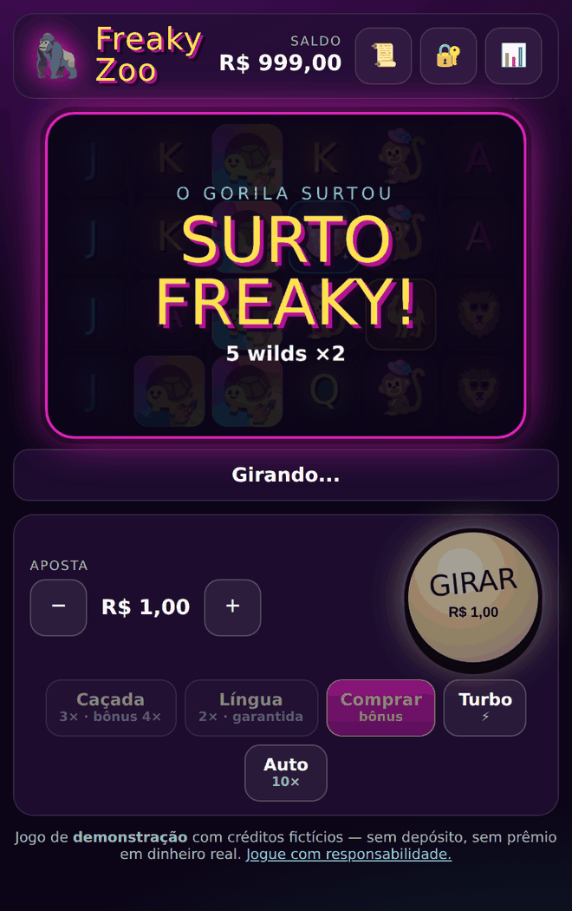
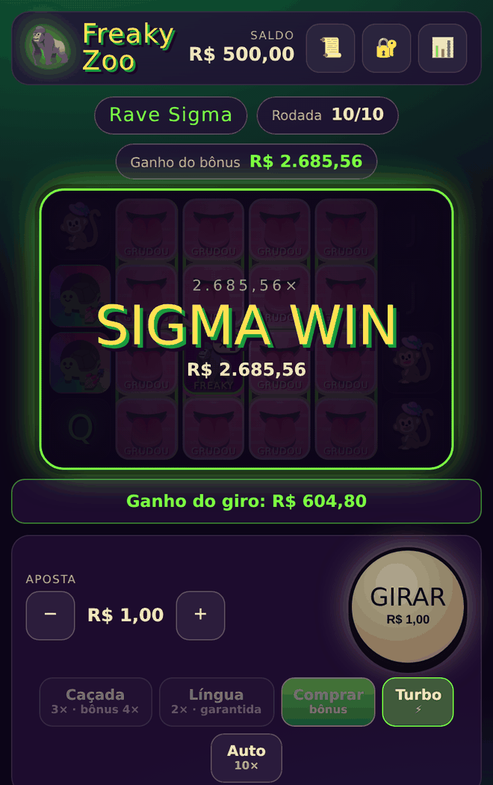

# Freaky Zoo

Slot 6×4 com 4.096 ways, volatilidade muito alta e ganho máximo de 25.000×,
feito para sair no formato de matemática da **Stake Engine**. Um camelo que
lambe (wild no rolo inteiro) ou cospe (seus símbolos altos viram carta), um
gorila freaky com multiplicador, uma festa e uma rave de bônus.



> ⚠️ **Jogo de demonstração.** Créditos fictícios, sem depósito, sem prêmio em
> dinheiro real. Material de estudo de como a matemática de um slot moderno é
> desenhada, calibrada e empacotada para um agregador.

---

## 1. Resumo

| | |
|---|---|
| **Grade** | 6 rolos × 4 linhas, fitas de rolo físicas |
| **Pagamento** | 4.096 ways, da esquerda para a direita, 3+ rolos |
| **RTP** | **96,50% em todos os 5 modos** (a Stake aceita 90–98%, com ≤ 0,5 p.p. entre modos) |
| **Volatilidade** | muito alta — desvio padrão de **39×** a aposta por rodada |
| **Frequência de acerto** | 27,9% no jogo base |
| **Ganho máximo** | **25.000×** — 1 em ~1,9 milhão de rodadas no base |
| **Festa Freaky** (bônus) | 3 globos — 1 em 249 · compra 100× |
| **Rave Sigma** (super bônus) | 4+ globos — 1 em 4.841 · compra 500× |
| **FeatureSpins** | Caçada Freaky (3×) · Língua Garantida (2×) |
| **Saída Stake Engine** | `index.json` + `lookUpTable_*.csv` + `books_*.jsonl.zst`, verificados |

---

## 2. O elenco

| Símbolo | Código | Papel |
|---|---|---|
| 🦍 **Gorila Freaky** | `W` | Wild dos rolos 2 a 6. Nos bônus vem com multiplicador ×2 a ×100 |
| 🐪 **Camelo** | `C` | Especial dos rolos 2 a 5: **língua** ou **cuspe** |
| 🪩 **Globo de Discoteca** | `S` | Scatter: dispara os bônus |
| 🦁 **Leão Sigma** | `H1` | Alto — o que mais paga (mogger oficial) |
| 🐒 **Macaco do Chapéu Rosa** | `H2` | Alto |
| 🐢 **Tartaruga Pride** | `H3` | Alto |
| **A · K · Q · J** | `L1`–`L4` | Baixos |

Os códigos seguem a convenção da math-sdk da Stake (H = alto, L = baixo, W =
wild, S = scatter) e são o que aparece nos books. Nome, emoji e arte ficam em
`src/freaky/ui/skins.js`; os prompts para gerar as ilustrações estão em
**[FREAKY_PROMPTS.md](FREAKY_PROMPTS.md)**.

---

## 3. Regras

### Ways e multiplicadores

Paga toda sequência de 3 ou mais rolos vizinhos, a partir do rolo 1, que
contenha o símbolo (ou o gorila, do rolo 2 em diante). O valor da tabela é
**por way**; o número de ways é o produto de quantas vezes o símbolo aparece
em cada rolo.

Multiplicadores de wild **somam dentro do rolo e multiplicam entre rolos**:

```
W_r    = soma, no rolo r, de 1 para cada símbolo e do multiplicador de cada gorila
prêmio = tabela[símbolo][rolos] × W_1 × W_2 × … × W_L
```

Um rolo com um Leão e um gorila ×5 vale 1 + 5 = 6 para o Leão; dois gorilas
×10 em rolos diferentes dão ×100. Como o rolo 1 nunca tem wild, todo way
pertence a um único símbolo — não existe contagem dupla.

### Tabela de prêmios (múltiplos da aposta, por way)

| Símbolo | 3 | 4 | 5 | 6 |
|---|---:|---:|---:|---:|
| 🦁 Leão Sigma | 0,08× | 0,15× | 0,40× | **0,80×** |
| 🐒 Macaco | 0,05× | 0,10× | 0,25× | 0,50× |
| 🐢 Tartaruga | 0,04× | 0,08× | 0,15× | 0,30× |
| A | 0,02× | 0,04× | 0,08× | 0,15× |
| K | 0,02× | 0,03× | 0,06× | 0,12× |
| Q | 0,01× | 0,02× | 0,05× | 0,10× |
| J | 0,01× | 0,02× | 0,04× | 0,08× |

**Por que os valores por way são pequenos.** O jogo tem só 7 símbolos
pagantes em 4 linhas (pedido de projeto: 3 bichos + A, K, Q, J). Cada símbolo
aparece em média em ~0,7 célula por rolo, então ways longos e múltiplos são
comuns: com pilhas, um Leão ×6 com 4×3×2×2×3×2 = **288 ways** paga
0,80 × 288 = **230×**. O que dá o prêmio é a multiplicação — de ways e de
gorilas. Um jogo com 12 símbolos pagaria mais por way e ganharia menos ways.

### 🐪 Camelo: língua ou cuspe

Aparece nos rolos 2 a 5 e reage na hora em que cai:

| | Efeito | Base | Festa | Rave |
|---|---|---:|---:|---:|
| 👅 **Língua** | o rolo inteiro vira wild (menos globos e gorilas, que mantêm o multiplicador) | 60% | 80% | **100%** |
| 💦 **Cuspe** | todo Leão vira A, Macaco vira K, Tartaruga vira Q; o camelo vira J | 40% | 20% | 0% |

Com dois camelos na tela, cada um sorteia a própria reação; **todos os cuspes
resolvem antes das línguas** (a língua de um cobre o estrago do outro no rolo
dele). O cuspe é o lado ruim de propósito — é o que dá drama ao camelo — e
está dentro da conta do RTP como qualquer outra regra.

No jogo base há camelo na tela em **11,9%** dos giros.



### 🦍 Gorila Freaky

Wild dos rolos 2 a 6. No jogo base vale ×1. **Nas rodadas grátis cada gorila
chega com multiplicador** sorteado de ×2, ×3, ×4, ×5, ×10, ×20, ×50 ou ×100.

### ⚡ Surto Freaky

Em **1,79%** dos giros do jogo base o gorila invade a tela e joga 2 a 5 wilds
×2 em células aleatórias dos rolos 2 a 6. Um giro com surto paga em média
**9,05×** a aposta — é a principal fonte de ganho grande fora do bônus.



### 🪩 Globos e bônus

| Globos no jogo base | Bônus | Rodadas | Chance exata |
|---:|---|---:|---:|
| 3 | Festa Freaky | 10 | 1 em 248,6 |
| 4 | Rave Sigma | 10 | 1 em 4.971 |
| 5 | Rave Sigma | 12 | 1 em 186.414 |
| 6 | Rave Sigma | 15 | 1 em 16.777.216 |

Dentro de qualquer bônus, 3+ globos dão **+5 rodadas** (cerca de 4,4% dos
bônus ganham rodadas extras).

**Festa Freaky** — gorilas com multiplicador em todo giro, camelo lambendo 80%
das vezes. Média de 96,5× a aposta.

**Rave Sigma** — o camelo nunca cospe, e a língua **gruda**: o rolo lambido fica
wild até o fim do bônus. Cada rolo grudado multiplica por 4 todos os ways que
passam por ele, e gorilas com multiplicador caem por cima. Média de 482,5× a
aposta; bate o teto de 25.000× em 1 de cada 1.133 Raves.



### Teto

O total da rodada trava em **25.000×** a aposta. Ao atingir, a rodada termina
na hora e as rodadas grátis restantes são descartadas (evento `wincap` no
book).

### Ordem de resolução de um giro

Fixa, porque define o consumo do RNG — e portanto a reprodutibilidade:

1. paradas das 6 fitas
2. (Rave) rolos grudados voltam wild
3. (bônus) multiplicador de cada gorila
4. (base) Surto Freaky
5. camelos, da esquerda para a direita: todos os cuspes, depois todas as línguas
6. avaliação dos ways
7. contagem de globos: gatilho ou +5 rodadas

---

## 4. Modos de aposta

Todos com o mesmo RTP — nenhum modo é melhor que outro, só muda a variância.

| Modo | Custo | O que muda | RTP | Acerto | Desvio padrão | Ganho máximo |
|---|---:|---|---:|---:|---:|---:|
| **Giro normal** (`base`) | 1× | — | 96,50% | 27,9% | 39× | 1 em 1,9 mi |
| **Caçada Freaky** (`hunt`) | 3× | Festa 1 em 64 (3,9× mais), Rave 1 em 549 (8,8× mais) | 96,50% | 29,8% | 32× o custo | 1 em 330 mil |
| **Língua Garantida** (`lingua`) | 2× | todo giro tem um camelo lambendo | 96,50% | 41,0% | 20× o custo | 1 em 1,9 mi |
| **Comprar Festa** (`festa`) | 100× | 10 rodadas da Festa Freaky | 96,50% | 99,1% | 4,9× o custo | 1 em 11,5 mil |
| **Comprar Rave** (`rave`) | 500× | 10 rodadas da Rave Sigma | 96,62% | 99,5% | 2,9× o custo | 1 em 1.133 |

Os RTPs são do estimador decomposto com 5× mais amostras (`npm run
freaky:tune -- --precise`); o intervalo de confiança de 95% vai de ±0,16 p.p.
(base) a ±0,39 p.p. (compra da Festa). Acerto, desvio padrão e distribuições
vêm de simulação direta (`npm run freaky:sim -- --all`). Na biblioteca da
Stake Engine o RTP de cada modo é **exato** — ver §6.

---

## 5. Matemática

### Fitas

Cada rolo é uma fita física de 116 a 130 posições, montada a partir de uma
contagem por símbolo (`REEL_COUNTS` em `config.js`) por um embaralhamento com
semente fixa. A montagem garante duas coisas:

- **pilhas**: símbolos normais entram em blocos de 1 a 4 iguais. A janela
  mostra menos símbolos diferentes, o acerto cai e os ganhos grandes chegam em
  bloco. Pilhas não mudam o valor esperado de ways (os rolos são independentes,
  então E[produto] = produto das médias) — mudam a forma da distribuição. É a
  alavanca clássica de volatilidade em jogos de ways.
- **especiais espaçados**: globo e camelo ficam a ≥ 4 posições um do outro, de
  forma circular. Nenhuma janela mostra dois especiais no mesmo rolo, e cada
  especial é visível em exatamente 4 paradas — a probabilidade de aparecer é
  **exata**: 4 × quantidade ÷ comprimento.

| Conjunto | Uso | Globo por rolo | Camelo na tela |
|---|---|---:|---:|
| `BR0` | jogo base | 6,25% | 11,9% dos giros |
| `BRH` | misturada ao BR0 na Caçada (39,4% dos giros) | 13,8% | 13,1% |
| `FR0` | Festa Freaky (8 gorilas e 2 camelos por rolo) | 6,25% | 22,8% |
| `FRS` | Rave Sigma (6 gorilas e 2 camelos por rolo) | 6,25% | 23,1% |

Com um especial no máximo por rolo e rolos independentes, a contagem de globos
é uma soma de Bernoullis — a distribuição sai por convolução, sem Monte Carlo.
É daí que vêm as chances exatas de gatilho.

### De onde vem o RTP

```
RTP_base   = B0 + F0
B0         = (1 − f)·B0[sem surto] + f·B0[com surto]              Monte Carlo
F0         = Σ_k P_k · E_k                                         P_k exato
E_k        ganho médio do bônus de k globos (Festa 10, Rave 10/12/15)

RTP_caçada = [(1 − h)(B0 + F0) + h(BH + FH)] / 3
RTP_língua = (BL + F0) / 2          (o camelo forçado nunca tira um globo)
RTP_compra = E_festa / 100   e   E_rave10 / 500
```

| Parcela | Valor |
|---|---:|
| Giro base sem surto | 0,3190× |
| Giro base com surto | 9,048× |
| **B0** — jogo base (f = 1,793%) | **47,55%** |
| E[Festa Freaky] | 96,50× |
| E[Rave Sigma] 10 / 12 / 15 rodadas | 483,1× / 739,6× / 1.258,7× |
| **F0** — bônus disparados no base | **48,95%** |
| **Total** | **96,50%** |

Metade do RTP mora num bônus que sai 1 vez a cada 236 giros. É a assinatura de
um jogo de volatilidade muito alta.

### Calibragem

Tabela de prêmios, fitas e regras são fixadas pelo desenho. O ajuste fino sai
de **cinco constantes**, cada uma resolvendo um alvo e afetando um modo só —
então a solução é sequencial, não um sistema acoplado:

| Constante | Valor | Alvo |
|---|---:|---|
| `tilt.festa` | −0,1919 | E[Festa] = 100 × 96,5% |
| `tilt.rave` | +0,0733 | E[Rave] = 500 × 96,5% |
| `frenzyChance` | 1,793% | RTP do jogo base = 96,5% |
| `frenzyChanceLingua` | 1,210% | RTP da Língua Garantida = 96,5% |
| `huntMix` | 39,438% | RTP da Caçada = 96,5% |

O **tilt** inclina a tabela de multiplicadores do gorila: peso_i × valor_i^θ.
A forma da distribuição fica a mesma, só desliza para cima ou para baixo. Ele
entra de forma não linear e é resolvido pela secante com **números aleatórios
comuns** — todas as avaliações usam a mesma semente, então E(θ) vira uma curva
lisa e a secante converge em 3 passos. A medição final usa outra semente, para
o intervalo de confiança ser honesto.

As outras três entram de forma **linear** (surto e escolha de fita são moedas
independentes do resto do giro): medidas as parcelas condicionais, a solução
é uma divisão. `npm run freaky:tune -- --solve` refaz tudo em ~2 minutos.

### Distribuição de ganhos

20 milhões de giros no jogo base:

| Faixa | Frequência |
|---|---:|
| sem ganho ou < 0,5× | 91,53% |
| 0,5× – 1× | 3,00% |
| 1× – 2× | 2,01% |
| 2× – 5× | 1,63% |
| 5× – 10× | 0,77% |
| 10× – 20× | 0,47% |
| 20× – 50× | 0,34% |
| 50× – 100× | 0,13% |
| 100× – 250× | 0,080% |
| 250× – 500× | 0,026% |
| 500× – 1.000× | 0,011% |
| 1.000× – 5.000× | 0,0073% |
| 5.000× – 25.000× | 0,0007% |

Bônus comprados (em múltiplos da aposta base):

| Faixa | Festa Freaky (100×) | Rave Sigma (500×) |
|---|---:|---:|
| < 10× | 40,7% | 18,2% |
| 10× – 50× | 31,2% | 22,5% |
| 50× – 100× | 11,0% | 12,2% |
| 100× – 500× | 13,8% | 27,5% |
| 500× – 2.500× | 3,0% | 15,7% |
| 2.500× – 25.000× | 0,36% | 3,9% |
| **25.000×** | **0,011%** | **0,081%** |
| mediana | 16× | 86× |
| paga menos que o preço | 82,8% | 80,2% |

(1 milhão de Festas e 500 mil Raves, simulação direta.)

Volatilidade muito alta tem esta cara: **metade das Festas paga menos de 16×**
e metade das Raves menos de 86×, e 4 de cada 5 bônus comprados devolvem menos
que o preço — o valor está na cauda. O RTP de uma sessão de 500 giros tem
desvio padrão de ~175 p.p. (39 ÷ √500); ele só converge para 96,5% em milhões
de rodadas.

### Ganho máximo

| Modo | Frequência do 25.000× |
|---|---:|
| base | 1 em 1,87 milhão |
| Caçada Freaky | 1 em 330 mil |
| Festa comprada | 1 em 11,5 mil |
| Rave comprada | 1 em 1.133 |

A Stake Engine pede que o ganho máximo seja **alcançável de verdade** — na
referência usada, pelo menos 1 em 10 milhões. O base tem ~5× de folga.

---

## 6. Stake Engine

Na Stake Engine o servidor (RGS) não roda o motor. Ele guarda uma
**biblioteca de rodadas já resolvidas** — os *books* — e, a cada aposta,
sorteia uma pelo peso da *lookup table*. O RTP que o jogador recebe é o da
biblioteca. O `tools/freaky-stake.js` gera essa biblioteca a partir do mesmo
motor que roda a demonstração.

```bash
npm run freaky:stake              # biblioteca completa (~4 min, ~330 MB)
npm run freaky:stake -- --quick   # 1/50 do tamanho, para testar o fluxo
```

Saída em `out/stake/freaky_zoo/`:

| Arquivo | Conteúdo |
|---|---|
| `index.json` | modos, custo, arquivos — formato exigido pelo upload |
| `books_<modo>.jsonl.zst` | uma rodada por linha: `id`, `events`, `payoutMultiplier` (+ `criteria`, `baseGameWins`, `freeGameWins`) |
| `lookUpTable_<modo>_0.csv` | `id,peso,payoutMultiplier` em `uint64` |
| `lookUpTableIdToCriteria_<modo>.csv` | balde de cada rodada |
| `reels/*.csv` | as quatro fitas, no formato de CSV da math-sdk |
| `config.json` | símbolos, tabela, gatilhos e modos |
| `stats.json` | RTP, acerto e ganho máximo de cada tabela |

`payoutMultiplier` é inteiro em centésimos da aposta base (1150 = 11,5×), a
unidade que o motor já usa internamente — nenhuma conversão com
arredondamento no caminho.

### Como a biblioteca é montada

Sortear 100 mil rodadas ao acaso e dar peso 1 a todas não funciona: com
desvio padrão de 39×, o RTP de 100 mil rodadas erra por ±25 p.p. A biblioteca
é montada por **amostragem estratificada**:

| Balde | Massa (probabilidade) | De onde vem |
|---|---|---|
| `basegame` | 1 − Σ P_k | exata, das fitas |
| `festa` | P_3 × (1 − c_festa) | exata × medida |
| `rave` | Σ_{k≥4} P_k × (1 − c_k) | exata × medida |
| `wincap` | Σ P_k × c_k | exata × medida |

(P_k = chance de k globos; c_k = chance de o bônus bater o teto, medida com
milhões de bônus sem trace.)

Cada balde recebe as suas rodadas — 100 mil do base, 20 mil Festas, 10 mil
Raves, 100 tetos — e as rodadas de teto são amostradas de forma condicional:
sorteia-se o tipo de gatilho com peso P_k × c_k, acha-se um giro base com k
globos, e repete-se **só o bônus** (com um RNG separado) até bater 25.000×.
Condicionar direto seria inviável: no base, o teto sai 1 vez a cada 1,9
milhão de rodadas.

Por fim, uma **reponderação de entropia mínima** acerta o RTP:

1. cada balde é inclinado (w ∝ e^{λ·x}) para a sua **média verdadeira**, medida
   à parte com milhões de rodadas sem trace;
2. um λ comum absorve o resíduo e crava o RTP da tabela no alvo.

Entre todas as reponderações que acertam as médias, é a de menor divergência
de Kullback-Leibler em relação à amostra; nunca gera peso negativo; e preserva
a massa de cada balde — as chances de gatilho e de ganho máximo da tabela
continuam as exatas. É o mesmo papel do otimizador da math-sdk.

### Verificação

Depois de gravar, o script refaz a checagem que o RGS faz no upload: todo id
do CSV existe no book, o `payoutMultiplier` do CSV bate com o do book, todo
book termina com `finalWin` igual ao payout, nenhum passa do teto, os pesos
cabem em `uint64` — e confere as regras de aprovação (RTP entre 90% e 98%,
≤ 0,5 p.p. entre modos, teto presente, acerto do base ≥ 1 em 20).

Resultado da última exportação:

| Modo | Books | Amostra crua | RTP da tabela | Acerto | 25.000× | Fatores de peso |
|---|---:|---:|---:|---:|---:|---|
| base | 130.100 | 91,92% | 96,5000% | 28,0% | 1 em 1,84 mi | 0,99 – 1,59 |
| hunt | 130.100 | 97,46% | 96,5000% | 29,8% | 1 em 327 mil | 0,85 – 1,01 |
| lingua | 130.100 | 97,42% | 96,5000% | 41,0% | 1 em 1,84 mi | 0,65 – 1,01 |
| festa | 100.200 | 95,65% | 96,5000% | 99,1% | 1 em 11,2 mil | 1,00 – 1,12 |
| rave | 100.200 | 96,58% | 96,5000% | 99,5% | 1 em 1.141 | 0,99 – 1,00 |

A coluna "amostra crua" mostra por que a reponderação existe: com pesos
iguais, a biblioteca do base pagaria 91,9%. A causa é ruído, não defeito — as
10 mil Raves sorteadas para o modo base têm média de 443,7×, 1,9 erro padrão
abaixo da média real (~466×). Os fatores dizem quanto o peso de uma rodada
precisou mudar; o maior (1,59) cai nas poucas Raves mais altas do balde.
Mais books por balde encolhem esses fatores, ao custo de arquivos maiores.

### Eventos dos books

A interface é um tocador de books: anima a lista `events` e nada mais. O mesmo
formato vale para a demonstração local e para o RGS.

| Evento | Campos | Quando |
|---|---|---|
| `reveal` | `board[rolo][linha]` `{name}`, `stops`, `reelSet`, `gameType`, `feature` | início de todo giro |
| `stickyWilds` | `reels` | Rave: rolos grudados voltam wild |
| `gorillaMultipliers` | `wilds[{reel,row,multiplier}]` | bônus: multiplicador de cada gorila |
| `freakyFrenzy` | `wilds[{reel,row,multiplier}]` | Surto Freaky |
| `camel` | `camels[{reel,row,action}]`, `spit[{reel,row,from,to}]`, `tongues[{reel,rows,sticky}]` | camelo reagiu |
| `winInfo` | `totalWin`, `wins[{symbol,kind,ways,plainWays,payPerWay,win,positions}]` | giro com ganho |
| `setWin` / `setTotalWin` | `amount` | ganho do giro / acumulado da rodada |
| `freeSpinTrigger` | `feature`, `totalFs`, `positions`, `bought` | entrada no bônus |
| `updateFreeSpin` | `amount`, `total` | contador de rodadas |
| `freeSpinRetrigger` | `totalFs`, `positions` | +5 rodadas |
| `freeSpinEnd` | `feature`, `amount` | fim do bônus |
| `wincap` | `amount` | bateu 25.000× |
| `finalWin` | `amount` | sempre o último; igual a `payoutMultiplier` |

Os eventos que mexem na grade carregam só a diferença, e um teste reconstrói a
grade a partir deles em dezenas de milhares de giros e reavalia os ways:
o ganho recalculado bate com `winInfo` em todos. É o que garante que a tela
nunca mostre um prêmio que a grade não justifica.

### Front no RGS

Aberto pela Stake, o jogo recebe `sessionID` e `rgs_url` na URL e troca o motor
local pelo RGS (`src/freaky/ui/rgs.js`):

```
POST /wallet/authenticate   { sessionID }                 -> saldo, níveis de aposta, rodada aberta
POST /wallet/play           { sessionID, amount, mode }   -> saldo, rodada (book)
POST /wallet/end-round      { sessionID }                 -> saldo final
```

Dinheiro em inteiros com 6 casas (1.000.000 = 1), a mesma unidade que a
demonstração usa. Uma rodada que ficou aberta (queda de conexão) é tocada e
fechada ao reabrir.

> A página do RGS não documenta o campo exato dos eventos dentro de `round`; o
> cliente aceita `round.state` (usado pelo web-sdk) ou `round.events`. Confira
> contra a documentação vigente antes de publicar.

### Checklist para publicar

- [ ] `npm run freaky:stake` sem problemas na verificação
- [ ] subir a pasta `out/stake/freaky_zoo/` (math) no painel da Stake Engine
- [ ] `npm run freaky:bundle` e subir o front (com a arte final nos `art` dos símbolos)
- [ ] testar no ambiente de testes da Stake: autenticação, os 5 modos, rodada aberta
- [ ] revisar textos de regras (RTP e ganho máximo já aparecem na tela 📜)
- [ ] conferir exigências de jurisdição (`config.jurisdiction` do authenticate,
      p. ex. cassino social)

Fontes: [Stake Engine — diretrizes de aprovação](https://stake-engine.com/docs/approval-guidelines),
[math-sdk (GitHub)](https://github.com/StakeEngine/math-sdk) — formato dos
arquivos em `docs/rgs_docs/data_format.md` e API do RGS em
`docs/rgs_docs/RGS.md`.

---

## 7. Arquitetura

```
src/freaky/
  config.js     símbolos, tabela, fitas, gatilhos, modos, calibragem
  reels.js      montagem das fitas, sorteio das paradas, probabilidades exatas
  ways.js       avaliação de 4.096 ways com multiplicadores (laço quente)
  round.js      máquina de estados da rodada + eventos de book
  session.js    carteira de demonstração, provably fair
  sim.js        acumuladores de Monte Carlo (somáveis entre threads)
  stake.js      books, baldes, reponderação, lookup table, index.json
  ui/
    board-model.js  aplica eventos à grade (puro, testado contra o motor)
    skins.js        nome, emoji, cor e arte de cada símbolo
    rgs.js          cliente do RGS da Stake Engine
    app.js          tocador de books + controles
tools/
  freaky-tune.js    RTP decomposto e calibragem (paralelo)
  freaky-sim.js     simulação direta com histograma (paralelo)
  freaky-stake.js   exportação para a Stake Engine + verificação
```

O RNG (xoshiro128\*\*, CSPRNG e *provably fair*), o SHA-256 e a validação de
inteiros vêm de `src/engine/`, compartilhados com o Fortuna Real.

O motor é uma função pura de `(aleatoriedade, modo) → resultado` e trabalha
em centésimos da aposta, sem saber o que é dinheiro. A mesma linha de código
roda 20 milhões de vezes no simulador, gera a biblioteca da Stake e joga na
tela — o RTP medido é o RTP entregue.

---

## 8. Comandos

| Comando | O que faz |
|---|---|
| `npm test` | todos os testes (dos dois jogos) |
| `npm run serve` | abre as interfaces em `http://localhost:8080` |
| `npm run freaky:bundle` | `dist/freaky-zoo.html`, arquivo único que roda no celular |
| `npm run freaky:tune` | RTP decomposto de todos os modos (~30 s) |
| `npm run freaky:tune -- --precise` | 5× mais amostras (~2 min) |
| `npm run freaky:tune -- --solve` | resolve as 5 constantes de calibragem |
| `npm run freaky:sim -- --all` | simulação direta, acerto, volatilidade e histograma |
| `npm run freaky:stake` | biblioteca da Stake Engine, verificada |

Na demonstração, `?demoSeed=qualquer-coisa` na URL fixa a semente do servidor e
torna a sequência de rodadas reproduzível — `?demoSeed=zoo-3` e compre a Rave
para ver uma de 2.685×.

---

## 9. Limites e responsabilidade

- **Não é jogo certificado.** A demonstração roda no navegador; na Stake, quem
  sorteia é o RGS a partir da biblioteca.
- **O cliente do RGS não foi testado contra o servidor real** — só contra um
  servidor falso nos testes. Valide no ambiente de testes da Stake.
- **A arte é provisória** (emoji compostos em CSS). Os prompts estão em
  [FREAKY_PROMPTS.md](FREAKY_PROMPTS.md).
- **RTP do motor × RTP da tabela.** O motor tem RTP medido com ±0,2–0,4 p.p.
  de incerteza; a tabela exportada tem RTP exato por construção, porque a
  reponderação absorve o erro de amostragem.
- Slots têm valor esperado negativo: a 96,5%, a expectativa é perder 3,5% de
  tudo o que se aposta, e a volatilidade muito alta faz sessões curtas dizerem
  quase nada. Verificação de idade, limites e autoexclusão são obrigatórios em
  qualquer uso real.
