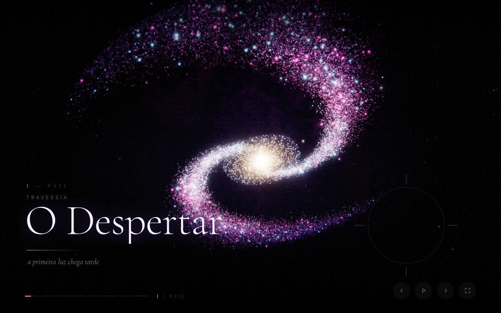
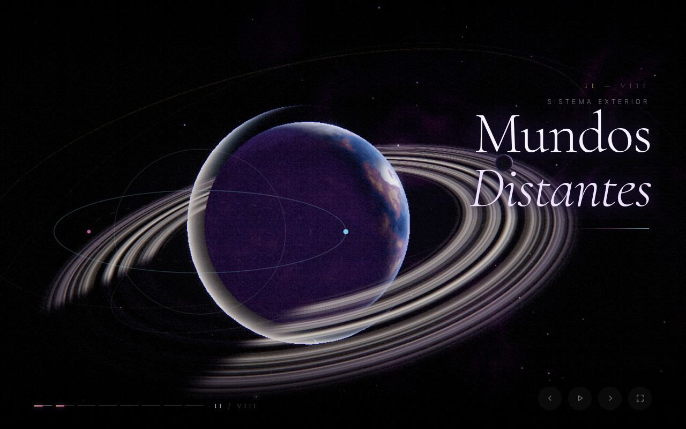
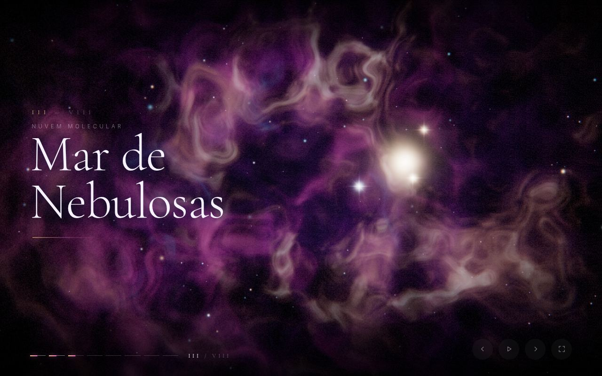
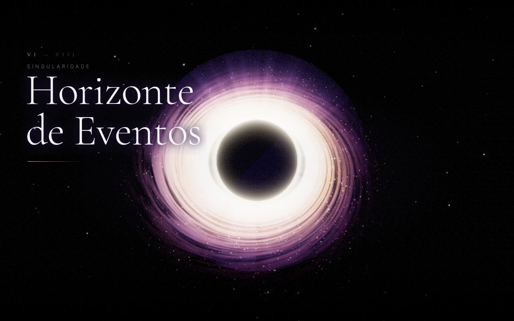
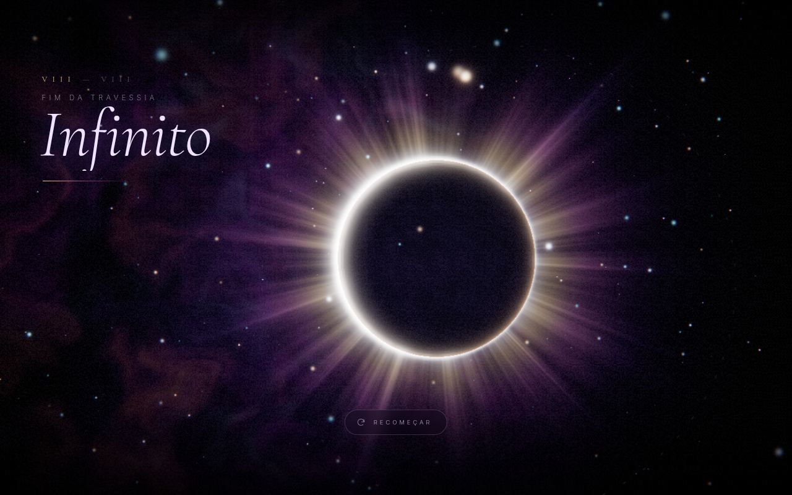

# Travessia

Slideshow interativo em WebGL: oito cenas de uma viagem pelo universo.
Abre no navegador, roda sozinho e responde a teclado, mouse e gestos.



| | |
|---|---|
|  |  |
|  |  |

```
galaxy/
├── index.html                  # a experiência inteira: HTML + CSS + JS
├── vendor/three.module.min.js  # Three.js r160 (MIT), cópia local
└── docs/                       # capturas das cenas
```

## Publicar no GitHub Pages

O repositório é público, então o Pages está disponível — só falta ligá-lo.
A raiz deste branch já tem `index.html` (redireciona para `galaxy/`) e
`.nojekyll`, então nada mais precisa ser preparado.

**Caminho curto** — Settings ▸ Pages ▸ *Build and deployment*:

| campo | valor |
|---|---|
| Source | Deploy from a branch |
| Branch | `claude/galaxy-interactive-slideshow-eonxvc` |
| Pasta | `/ (root)` |

Salvando, o site sobe em um ou dois minutos:

- **https://akenuj1-ai.github.io/Test/** → redireciona para a experiência
- **https://akenuj1-ai.github.io/Test/galaxy/** → endereço direto

**Caminho por Actions** — se preferir Source = *GitHub Actions*, este
repositório traz `.github/workflows/pages.yml`, que monta e publica o
site. Ele roda por disparo manual (aba Actions ▸ *Publicar Travessia* ▸
*Run workflow*) e exige permissão de escrita para workflows em
Settings ▸ Actions ▸ General ▸ *Workflow permissions*.

## Como abrir

**Por um servidor estático** — jeito recomendado, funciona sem internet:

```bash
npx http-server galaxy -p 8080   # depois abra http://localhost:8080
# ou: python3 -m http.server 8080 -d galaxy
```

**Clicando no arquivo** (`file://`) também funciona, mas aí o navegador
bloqueia o módulo local e o Three.js vem do CDN — precisa de internet.

## As oito cenas

| | Cena | O que acontece | Transição de saída |
|---|---|---|---|
| I | O Despertar | Galáxia espiral de 130 mil estrelas com rotação diferencial, faixas de poeira e regiões HII. A câmera avança até mergulhar no núcleo. | mergulho radial |
| II | Mundos Distantes | Planeta procedural com relevo, nuvens, atmosfera e anéis que projetam a sombra do planeta. Três luas em órbitas inclinadas. A luz gira e abre o lado escuro. | o planeta engole o quadro |
| III | Mar de Nebulosas | Nove camadas de nuvem volumétrica — claras e escuras — em profundidades diferentes, com parallax e um berçário estelar ao fundo. | a nuvem encobre a câmera |
| IV | Jardim Orbital | Esferas metálicas refletindo um ambiente procedural, cristais facetados, asteroides e trajetórias luminosas em torno de um centro invisível. | varredura de luz |
| V | Constelações Vivas | Estrelas ligadas por linhas que se desenham progressivamente. **O cursor acende o que passa perto.** | torção gravitacional |
| VI | Horizonte de Eventos | Disco de acreção com turbulência, rotação kepleriana e feixe relativístico; sombra, anel de fóton e halo lenteado; distorção da imagem no pós-processamento. | as estrelas se esticam |
| VII | Salto Interestelar | Túnel de rastros com aceleração, aberração cromática e borrão radial crescentes — e uma freada no fim. | clarão |
| VIII | Infinito | Eclipse com coroa filamentar, anel de diamante na entrada e a câmera se afastando devagar. | — |

## Controles

| | |
|---|---|
| **←** **→** · **PageUp/Down** | cena anterior / próxima |
| **Espaço** | pausa e retoma a reprodução automática |
| **1**–**8** · **Home** · **End** | ir direto a uma cena |
| **F** | tela cheia |
| Mouse | inclina levemente a perspectiva; na cena V acende as constelações |
| Toque | deslize para os lados; o arrasto também inclina a câmera |
| Barra inferior | oito segmentos clicáveis, o ativo preenche com o tempo |

A interface some sozinha depois de 2,8 s sem interação e volta ao primeiro
movimento. O laço para de desenhar quando a aba fica em segundo plano.

## Como foi feito

Um `WebGLRenderer` desenha a cena ativa num alvo *half-float* linear. Daí
o quadro passa por um *bright pass*, três níveis de bloom e uma composição
final que faz o tone mapping ACES e aplica lente gravitacional, aberração
cromática, rastro radial, vinheta e grão de filme — nessa ordem, com os
parâmetros vindo da própria cena a cada quadro.

Cada cena é um objeto isolado, com câmera e relógio próprios, construído
sob demanda (a seguinte é pré-compilada durante a atual). **Só a cena ativa
é atualizada e desenhada**; durante uma transição as duas vão para alvos
separados e um shader de sete modos faz a costura — cada modo empresta a
linguagem da cena que sai.

Nebulosas, superfície planetária, disco de acreção e coroa são ruído
simplex 3D com deformação de domínio, avaliado no fragment shader. Estrelas,
poeira e rastros são atributos de vértice animados na GPU: o processador
não toca em partícula nenhuma por quadro.

### Desempenho

Três perfis, escolhidos por `deviceMemory`, número de núcleos e tipo de
ponteiro, definem densidade de partículas (30% / 58% / 100%), resolução de
render (0,82× / 0,92× / 1×), `devicePixelRatio` e detalhe de geometria. Se
o quadro passa de 26 ms por 90 quadros seguidos, a escala de render cai de
novo, até 0,62×. No celular a composição, a tipografia e os gestos mudam junto.

### Movimento reduzido

Com `prefers-reduced-motion: reduce` a reprodução automática não começa, as
transições viram fusões curtas, o tempo interno das cenas corre a 25–30% e a
câmera fica parada num enquadramento escolhido. Rastro radial e aberração
saem; bloom, iluminação e composição continuam — a versão parada é para ser
igualmente bonita, não uma versão pobre.

## Dependências de internet

| O quê | Onde | Se faltar |
|---|---|---|
| **Three.js r160** | `vendor/three.module.min.js` | por `http://` roda offline; por `file://` cai no `cdn.jsdelivr.net` |
| **Cormorant Garamond + Inter** | Google Fonts | cai para Iowan/Palatino/Georgia e a pilha de sistema, sem quebrar o layout |

Nenhuma imagem externa: cada textura é gerada em código.

## Requisitos

Navegador com WebGL 2 — Chrome, Edge, Firefox e Safari 15+, no computador
ou no celular. Sem build, sem `npm install`.
