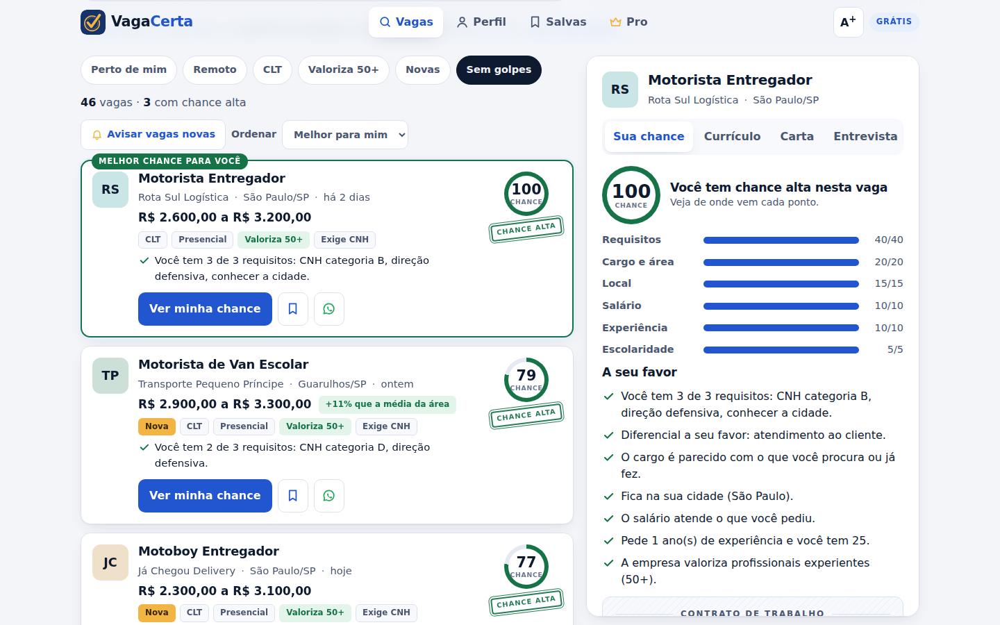

<p align="center"></p>

# VagaCerta

Busca de emprego para o Brasil que não só lista vagas: diz **qual a sua chance
real em cada uma e por quê**, adapta o currículo para a vaga, prepara para a
entrevista, **avisa quando a vaga tem cara de golpe** e manda vagas novas no
WhatsApp.

Um só código para **site, app instalável (PWA), Android e iPhone**. Sem
dependências: só Node 20+.

```bash
npm test          # 83 testes
npm start         # http://localhost:8080
npm run bundle    # dist/vagacerta.html — arquivo único, abre no celular
npm run alertas   # mostra os alertas de WhatsApp que seriam enviados
```

| Celular | Computador |
|---|---|
|  |  |

- **Marca**: [docs/MARCA.md](docs/MARCA.md)
- **API**: [docs/API.md](docs/API.md)
- **Como colocar no ar e nas lojas**: [docs/DISTRIBUICAO.md](docs/DISTRIBUICAO.md)

### Vagas reais

Sem chave nenhuma, o app mostra vagas de exemplo (fictícias). Com qualquer uma
das chaves abaixo, todas gratuitas, passa a mostrar **só vagas reais**,
buscando em todas as fontes ao mesmo tempo, sem repetir vaga:

| Fonte | Variável | Cadastro |
|---|---|---|
| Adzuna | `ADZUNA_APP_ID`, `ADZUNA_APP_KEY` | https://developer.adzuna.com |
| Jooble | `JOOBLE_KEY` | https://jooble.org/api/about |
| Careerjet | `CAREERJET_AFFID` | https://www.careerjet.com.br/partners/api/ |

```bash
JOOBLE_KEY=... ADZUNA_APP_ID=... ADZUNA_APP_KEY=... PAINEL_CHAVE=segredo npm start
```

Se uma fonte cair ou demorar mais de 6 s, as outras continuam. Buscas iguais
ficam 10 minutos em cache, para poupar a cota das APIs.

### Funil de vendas

Cada passo importante (visita, abrir vaga, gerar currículo, ver a oferta,
clicar em assinar, assinar) é registrado. Com `PAINEL_CHAVE` definida,
`/api/funil?chave=...` mostra quantas pessoas chegaram a cada etapa. No app,
o link **Painel do dono** no rodapé mostra o funil deste aparelho e um
**simulador de receita**.

---

## Por que é melhor que os sites que já existem

| O que a pessoa precisa | Sites comuns | VagaCerta |
|---|---|---|
| Saber se vale a pena se candidatar | Lista 500 vagas iguais | **Nota de chance de 0 a 100** com o que conta a favor e o que falta |
| Não cair em golpe | Nada | **Alerta de golpe**: taxa de cadastro, curso pago, salário irreal, pedido de dados bancários |
| Currículo que passe na triagem | Um currículo para tudo | **Currículo adaptado a cada vaga**, com o que a vaga pede primeiro, sem inventar nada |
| Chegar preparado na entrevista | Nada | **Perguntas prováveis e dicas**, inclusive as difíceis: “por que está parado?”, “experiência demais?” |
| Não perder a conta das candidaturas | Nada | **Quadro de candidaturas** que avisa quando cobrar retorno |
| Pessoas 50+ | Ignoradas | Filtro **“Valoriza 50+”**, botão **letra grande**, fonte feita para leitura fácil |
| Achar a vaga do jeito que escreve | Só palavra exata | Entende **sinônimos** (“faxineira” acha “limpeza”), **erro de digitação** (“motorsita”) e expressões (“home office”, “carteira assinada”) |
| Saber se o salário é bom | Nada | Selo **“+X% que a média da área”**, calculado com as vagas reais listadas |
| Começar rápido | Cadastro longo | **Quiz de 30 segundos**: 3 perguntas e já vê suas vagas com nota |
| Não perder vaga nova | E-mail que ninguém lê | **Alerta no WhatsApp** com as vagas novas da busca salva |
| Usar como app | Baixar app pesado | **Instala pelo site** em 1 toque, abre sem internet |

## Como ganha dinheiro

**Grátis + Pro (R$ 19,90/mês ou R$ 149/ano, 38% mais barato), com 7 dias de teste grátis.**

- Grátis e ilimitado: buscar vagas, ver a nota de chance, alerta de golpe.
  É isso que traz gente.
- Grátis com cota: 1 currículo adaptado, 1 carta e 1 preparação para
  entrevista **por dia**.
- Pro: tudo ilimitado + alerta de vagas novas no WhatsApp/e-mail.
- Confiança: 7 dias de garantia e **pausa grátis quando a pessoa for
  contratada**. Quem arruma emprego fala bem e volta quando precisar.

Onde o app oferece o Pro, sempre no momento em que a pessoa vê valor:

1. **Currículo pronto, mas borrado**: quando a cota grátis acaba, o currículo
   daquela vaga aparece gerado e desfocado, com “Liberar com 7 dias grátis”.
2. **No meio da lista**: “Você tem N vagas com chance alta. Mande um currículo
   sob medida para cada uma.”
3. **Depois de gerar o currículo grátis**: “Gostou? No Pro, sem limite.”
4. **Página Pro**: mensal × anual, tabela de comparação, garantia e perguntas
   frequentes.

Crescimento: botão **Enviar pelo WhatsApp** em toda vaga. Quem manda vaga para
um amigo traz um usuário novo.

### A conta, sem ilusão

R$ 1 milhão por ano ≈ R$ 83 mil por mês ≈ **4.200 assinantes pagando ao mesmo
tempo** (antes de impostos e taxas de pagamento). Em apps assim, 2% a 5% dos
usuários grátis costumam assinar, então são necessários algo como **85 mil a
200 mil usuários ativos**. É possível, mas depende principalmente de
divulgação (TikTok, grupos de WhatsApp, parcerias com igrejas, ONGs e
prefeituras), não só do código.

## O que está pronto

- Busca inteligente com sinônimos, erro de digitação e sugestões
  (`src/core/relevancia.js`) e filtros rápidos.
- Quiz de 30 segundos e barra de perfil completo (`src/core/perfil.js`).
- Comparação de salário com a mediana da área (`src/core/mercado.js`).
- Funil de conversão e simulador de receita (`src/core/metricas.js`).
- Nota de chance explicada (`src/core/match.js`).
- Detector de golpe (`src/core/golpe.js`).
- Currículo, carta e preparação para entrevista (`src/core/curriculo.js`).
- Planos e cotas diárias (`src/core/planos.js`), assinatura **simulada**.
- Quadro de candidaturas (`src/core/candidaturas.js`).
- Vagas reais via Adzuna, Jooble e Careerjet, juntas pelo agregador
  (`src/sources/`), ou de exemplo (`src/core/exemplos.js`, **todas
  fictícias**).

Os dados do usuário ficam só no navegador dele (localStorage).

## Telas

- **Celular**: menu embaixo, detalhe da vaga em folha que sobe, botões de
  48 px, letra grande opcional.
- **Computador** (a partir de 1100 px): quiz ao lado do topo e lista com o
  detalhe fixo ao lado, sem janela por cima.
- **App instalado**: ícone próprio, atalhos (Vagas, Salvas, Pro), abre sem
  barra de navegador e sem internet.
- **Modo escuro** seguindo o aparelho.

## Próximos passos para virar negócio

1. **Pagamento de verdade**: Mercado Pago ou Stripe, com Pix e cartão.
2. **Contas e banco de dados**: login, perfil salvo em servidor.
3. **LGPD**: política de privacidade, consentimento e exclusão de dados
   (obrigatório para guardar currículos).
4. **Parcerias diretas com empresas** para anunciar vagas (outra fonte de
   receita). Raspar LinkedIn/Indeed viola os termos deles e é bloqueado.
5. **Aprovar o modelo de mensagem** de alerta no painel da Meta (o envio
   já está pronto em `tools/enviar-alertas.js`).
6. **Redação com IA**: um modelo de linguagem melhora o texto do currículo,
   mantendo a regra de nunca inventar experiência.
7. **Currículo em PDF** bonito para baixar.

## Estrutura

```
src/core/         regras do negócio, puras e testadas (sem DOM)
src/sources/      fontes de vagas reais (Adzuna, Jooble, Careerjet) + agregador
src/servidor/     servidor HTTP, rotas da API, limite de requisições
src/integracoes/  WhatsApp Cloud API
src/ui/           interface, PWA (manifesto, service worker) e marca/
tools/            subir o servidor, enviar alertas, empacotar, gerar marca
test/             testes (node:test), inclusive do servidor no ar
Dockerfile        imagem de produção
```
